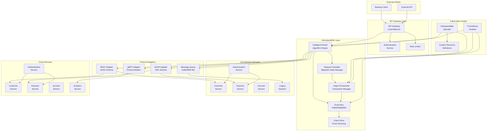
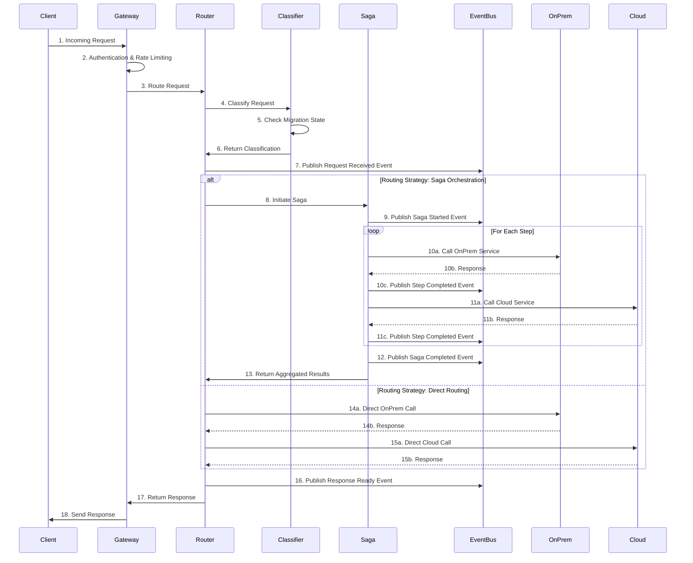
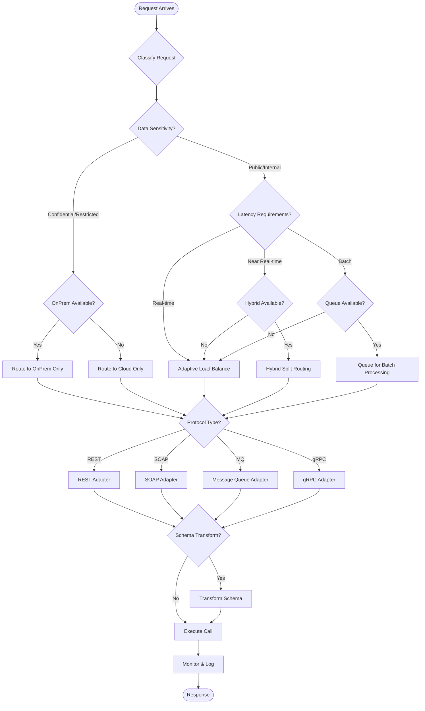
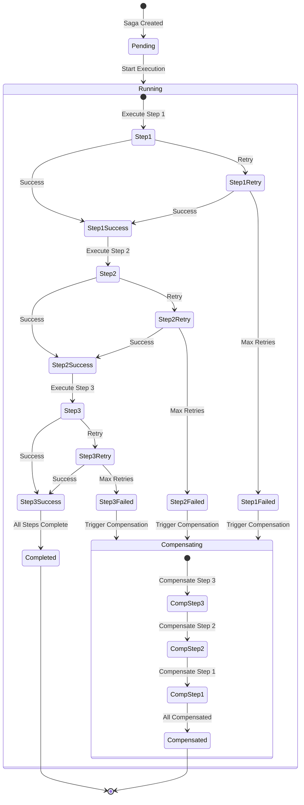
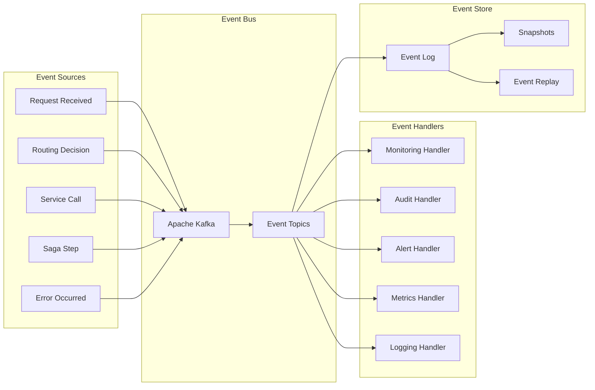
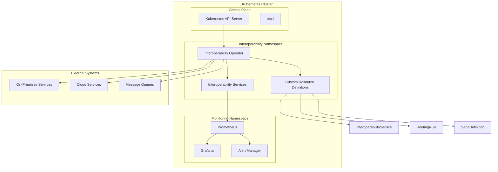
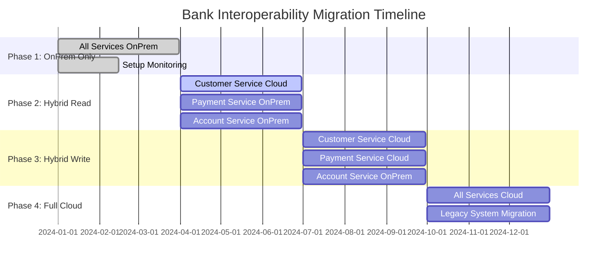
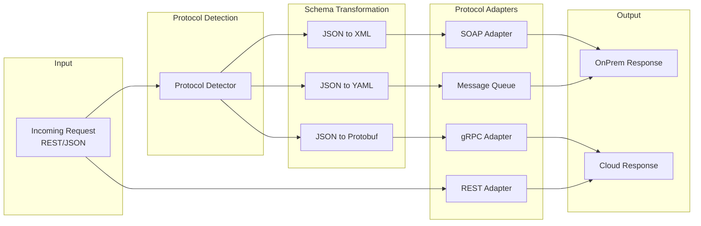

# Architectural Diagrams for Bank Interoperability Layer

## 1. High-Level System Architecture

## 2. Request Flow Diagram

## 3. Intelligent Routing Algorithm Flow

## 4. Saga Pattern Implementation

## 5. Event-Driven Architecture

## 6. Kubernetes Operator Architecture

## 7. Migration Timeline Visualization

## 8. Protocol and Schema Transformation Flow

## Key Features of the Architecture

### 1. **Intelligent Routing Algorithm**
- **Data Sensitivity Analysis**: Routes confidential data to on-premises
- **Latency Requirements**: Optimizes for real-time vs batch processing
- **Migration State Awareness**: Adapts routing based on current migration phase
- **Load Balancing**: Distributes load across on-premises and cloud services

### 2. **Saga Pattern Implementation**
- **Distributed Transactions**: Manages complex multi-step operations
- **Compensation Logic**: Handles rollbacks across different environments
- **Dependency Management**: Ensures proper execution order
- **Retry Mechanisms**: Handles transient failures gracefully

### 3. **Event-Driven Architecture**
- **Event Sourcing**: Maintains complete audit trail
- **Real-time Monitoring**: Tracks all operations and performance
- **Loose Coupling**: Services communicate through events
- **Scalability**: Easy to add new event handlers

### 4. **Protocol and Schema Adaptation**
- **Multi-Protocol Support**: REST, SOAP, MQ, gRPC
- **Schema Transformation**: JSON, XML, YAML, Protocol Buffers
- **Pluggable Adapters**: Easy to add new protocols
- **Transparent Conversion**: Seamless data transformation

### 5. **Kubernetes Native**
- **Operators**: Declarative management of interoperability components
- **Custom Resources**: Domain-specific configuration
- **Auto-scaling**: Dynamic resource allocation
- **Health Monitoring**: Built-in observability

This architecture provides a robust, scalable, and maintainable solution for your bank's interoperability layer that can handle the complex migration scenario while maintaining high availability, data consistency, and operational excellence.